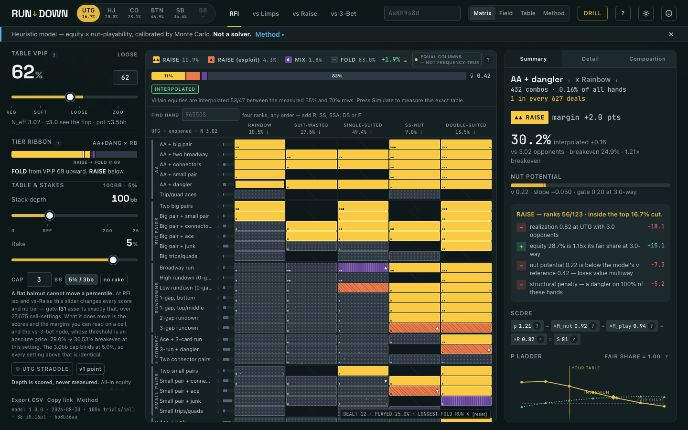

# RUNDOWN

**A 4-card PLO preflop range explorer for very loose lobbies.**

> *The range doesn't get wider — it gets nuttier.*

[](LICENSE)
[](#regenerating-the-data)
[](#quick-start)

Hold'em got its 13×13 chart because it only has 169 strategically distinct starting hands. PLO
has 270,725, so it never got one. RUNDOWN is that chart done at the resolution PLO actually
supports: a **29-row × 5-column hand-class matrix** — rank archetype × suit topology, an exact
partition of all 270,725 hands — where every cell is colored by action tier and the whole
surface morphs live under a table-VPIP slider.



<!-- docs/screenshot.png is the shipping page at 1440×900: Matrix view, UTG · RFI · VPIP 62,
     AA + dangler × Rainbow selected so the rail Tier Ribbon and the inspector Summary are both
     populated, and the villain profile ON at an off-lattice VPIP so the `interpolated` badge and
     its Simulate sentence are in frame. Regenerate it from the built page at the same viewport and
     state if the UI moves. Note the page auto-runs its 12-step tour 400 ms after a first visit
     (gated on sessionStorage 'rundown.tour' and an empty location.hash), so a capture from a fresh
     browser profile must set that key before the page's own scripts run — otherwise the tour opens
     over the grid and its per-step paint() resets the villain profile. -->

---

## What this is, and what it is not

This is **not** a GTO solver and does not approximate one. PLO preflop solutions are not
publicly solved to equilibrium at 6-max with realistic stacks. What this tool ships is a
**transparent heuristic model**: for each starting hand we measure, by Monte Carlo, its equity
against *N* random opponents for N = 1..7, derive two numbers (raw strength, and how well the
hand *scales* into multiway pots), combine them with a documented scoring formula, and cut the
result at percentile thresholds that vary with position, action and table looseness. Every
constant in the formula is listed in the README and every one is a judgement call. The model's
job is to make the *shape* of good PLO preflop reasoning legible and explorable, not to be an
oracle. The Monte Carlo layer is objective; the scoring layer is opinion.

Every constant referred to above is in [`docs/METHODOLOGY.md`](docs/METHODOLOGY.md) and in the
`constants` object of `data/model.json` — and the app's **Method** view renders that object
straight out of the shipped data, so the documentation cannot drift away from the behavior.
Change a constant, regenerate, and the docs in the app change with it.

---

## Quick start

**Nothing to install. No build step. No server.**

```bash
git clone https://github.com/lkamicle-web/4-card-plo-.git
cd 4-card-plo-
open index.html          # macOS   (Linux: xdg-open · Windows: start)
```

Or download `index.html` on its own and double-click it. It runs from `file://`, offline, with
the whole model embedded — there is no `fetch`, no API, no telemetry. The only network requests
the page can make are the two Google Fonts stylesheets, and the layout is authored on the
fallback metrics so it is pixel-identical with fonts blocked.

**New to the vocabulary?** The first visit runs a 30-second tour, the **?** in the top bar (or
`G`) opens the how-to-read-this guide, the small **i** on every row and column explains that
hand class with live example hands, and every **?** in the left rail defines the number next to
it — including the Δ-pin colour mode and the rest of the display controls.

**GitHub Pages:** the repo is Pages-ready as-is. Settings → Pages → *Deploy from a branch* →
root of your default branch. `index.html` is the whole site; `src/`, `data/`, `scripts/` and
`test/` are there for people who want to read, audit or regenerate what is in it, not for the
page to load.

---

## What the VPIP slider models

VPIP is *voluntarily put money in pot* — the share of hands a table plays. The slider runs
**25 → 90**, which is the domain the model was measured over: 25 is a reg-infested game, 90 is
the lobby this tool was built for. It is not a cosmetic filter over a fixed chart. Moving it
changes one input — **how many opponents you expect to see a flop with** — and everything
downstream is recomputed from that:

```
c(v)        = 0.55 · v^1.25              cold caller behind you
c_blind(v)  = min(0.95, 1.5·c(v) + 0.10) blinds defend wider
c_limper(v) = min(0.90, 0.45 + 0.50·v)   a committed limper facing your iso
```

At UTG in an unopened pot, `N_eff = 1 + 3·c(v) + 2·c_blind(v)` — 2.76 expected players at
VPIP 55, 4.09 at VPIP 90. That number then drives:

- **which equity you are graded on** — `eq[N]` is interpolated at the fractional `N_eff`, and
  multiway equity punishes different hands very differently (`AA72r` falls from 61.2% heads-up
  to 17.9% six-way, barely above the 16.7% breakeven; `AAKKds` still runs 2.10× breakeven);
- **realization** — a hand with no nut potential realizes only 0.60× its equity five-way, before
  the positional base (0.90 in the SB to 1.06 on the button) is applied;
- **the nut multiplier** — `M_nut` weight on nut-scalability grows from 0.15 heads-up to 0.67
  six-way, so looseness rewards nuttiness rather than rewarding trash;
- **a hard nut gate** — below a ν floor that rises with `N_eff` (capped at 0.30), a hand is
  demoted one tier no matter how it scored;
- **the width of the aggressive range**, which widens only mildly with VPIP.

That last pairing is the whole thesis, and the Thesis Sparkline in the rail keeps both lines on
screen at all times. Drag UTG from 25 to 90: the range the grid actually paints goes from
**14.1% to 16.6%** of all hands while the mean nut potential of that range climbs from **0.409 to
0.425**. **The range barely gets wider, and what little it gains it spends on nuttiness**, and on
the matrix the gold tier doesn't just grow — it *migrates right*, out of rainbow and suit-wasted
into nut-suited and double-suited. Both numbers are printed on the sparkline's endpoints (the nut
share to two places), so you can check them against this paragraph. Every width quoted in this
README, on the sparkline and in the tour is the **painted** range — the cells the grid actually
colors gold, after the nut gate — never the percentile the model aims at, which is a larger and
less honest number. The one place the app shows that percentile is the small figure under each
position chip, and the Method view's `width cut` row: those are the model's *target*, labelled as
such, and at UTG@90 they run about 1.6 points above what the grid paints.

**The nut-share move is small, and at most nodes it is negative.** At UTG RFI the model gains 1.6
points of nut share across the whole slider. At the isolation and vs-Raise nodes the raw change
goes the *other* way (CO vs limpers −1.7, BB vs limpers −2.5, BTN vs a raise −2.8), because
widening a range necessarily reaches deeper into the pool. An earlier version of this README
claimed +5.6 at CO vs limpers; that number came from a range that was quietly *collapsing* as the
slider rose, and it is gone.

What survives is the claim the tool is actually making, and it is a claim about **ordering**: hold
the width fixed, and the range a loose table opens is nuttier than an equally wide range drawn
from the tight-table ordering — at all 15 (node, position) pairs, by +0.1 to +2.1 points. *A loose
table re-sorts your range toward nut potential; it does not make a wider range nuttier in the
mean.* That re-sort is the composition shift the matrix shows directly, and it is the larger
effect. Invariant I11 asserts it; I21 separately asserts that the painted range really does widen.

The orange **T2** tier is the direct read-out of the exploit: those are the hands that are in
your raising range *only because the table is loose*. At VPIP 25, T2 is empty by construction.
At the vs-3-bet node T2 means something different — the *ambush call*, a hand you continue with
only because their range is face-up — and in this build it is **structurally empty at every
seat**: no cell clears the call price and the nut floor while still measuring under 45% heads-up
against a random hand. We report that and hide the chip rather than moving a threshold until
something qualifies. See [`docs/METHODOLOGY.md` §7](docs/METHODOLOGY.md).

---

## What v2 added

Five things. All of them are off, or the identity, at their defaults — invariant **I22** asserts
that the whole v2 pipeline reproduces v1's tiers *bit for bit* at 100bb, no rake, no straddle,
random villains — so the page you open is still the one v1 shipped, and everything below is
something you turn on.

- **Stack depth, rake and a UTG straddle.** Three dials in the rail, all scoring-layer. Depth
  (40–250bb) re-sorts the grid along the nut-potential axis; the straddle tightens the opening
  range at every seat and makes it nuttier. Depth is **scored, never measured**, and the page says
  so next to the slider. The rake dial is honest about doing almost nothing: a flat haircut cannot
  move a percentile, so it changes every score and no tier — except at the vs-3-bet node, where the
  threshold is an absolute price.
- **A villain profile.** Equity against opponents who *fold their worst hands* instead of against
  random ones, measured at table VPIP 25 / 40 / 55 / 70 / 90. The headline is not that weak hands
  do badly against a tight pool — it is that **rank overlap decides who loses**: at a 25% table a
  broadway run × rainbow gives up **−25.8** equity points heads-up, while a low rundown × nut-suited
  *gains* **+11.2**. Off by default, because it is a different measurement from the one the shipped
  tiers are cut from.
- **Expand a cell in place.** Click a cell and it splits into its sub-buckets — combos, equity, ν,
  and the tier each would earn *scored as-if standalone*. It is where the TT/JJ story becomes
  visible. At the vs-3-bet node it reports that there is no bucket verdict rather than inventing
  one from machinery that measures something else.
- **Hand search.** Type `9655DS` — four ranks in any order, with an optional `R`/`SS`/`SSA`/`DS`/`F`
  suffix — and the grid goes to that cell, or opens the one sub-bucket the shape pins.
- **A Simulate button.** When the villain profile is on at a VPIP or a discipline the shipped
  lattice never measured, the page stops interpolating and offers to measure it for real:
  **3,075,000 trials** in Web Workers spawned from a Blob URL, about **3.4 seconds** with four
  workers, **±0.32** points against the shipped ±0.16. There is exactly one re-run on offer and it
  lands on a hard ceiling of 100,000 trials/cell — the point at which a simulated number is as
  precise as the file it is arguing with. Seeded, so a re-run is bit-identical. Cached, but never
  advertised as saved. And every equity on screen carries a badge saying whether it is shipped,
  interpolated, or measured in your browser.

Still no network: the Simulate button is the only code in the page that computes on demand, and it
runs only when you press it.

---

## Who this is for

Players in **loose, low-stakes 4-card PLO lobbies** — the games where five people see a flop
for a pot-sized raise, where nobody folds preflop, and where the same regs 3-bet a face-up
range of aces and kings and are visibly unhappy when you call.

Three things in it exist specifically for that pool:

1. **A VPIP axis instead of a single chart.** Charts published for 25% tables are the wrong
   tool at a 75% table and they fail in a direction that costs money: they widen you into
   non-nut hands that lose stacks five-way.
2. **A nut-scalability number (ν) with its own visible weight.** The nut-flush premium in raw
   preflop equity is only about **+0.5 points** (`AJT9` ace-suited 56.31% vs J-suited 55.79%).
   Anyone building this model from equity alone concludes nut suits barely matter, and is wrong.
   The premium is in *realization* multiway, which is why ν and `M_nut` exist as separate
   machinery instead of being folded into the equity number.
3. **A vs-3-bet lab for face-up 3-bettors.** When the villain's range is known, "equity vs
   random" is the wrong number entirely. Against `AsAhKdQc`, `5432ds` runs **47.5%** — it
   *gains* about 7 points by being 3-bet at — while the premium-looking `AdKcQsJh` runs
   **18.0%** because three of its four ranks are in the villain's hand, and `KK98ds` runs
   34.1%, a trap you must fold. You need ~29% against a pot-sized 3-bet. Domination, not
   high-card quality, is what kills you here.

If you play tight, tough, short-handed PLO, this model is out of its measured domain and says
so on screen.

---

## Regenerating the data

Node ≥ 22, **zero npm dependencies** anywhere in the repo — stdlib only (`node:worker_threads`,
`node:fs`, `node:test`). Everything is seeded, so a run is reproducible bit-for-bit.

```bash
node scripts/generate-data.mjs          # enumerate, measure, derive, emit data/model.json
node scripts/verify.mjs                 # 46 gates: D1-D8, V1-V6, B, invariants I1-I31
node scripts/build.mjs                  # compile src/shell.html -> index.html
node --test test/*.test.mjs             # evaluator, taxonomy and policy unit tests
node smoke.mjs                          # headless browser gate (Playwright, if installed)
```

`generate-data.mjs` runs the verifier itself at the end and refuses to emit if any gate fails.
Useful flags: `--fast` (÷10 trials, ≈25 s, for CI — `build.mjs` refuses to inject a fast
dataset without `--allow-fast`), `--workers=N`, `--out=path`. There is deliberately **no global
seed flag**: every Monte Carlo stream is keyed by its own stage and cell name, which is what makes
a single cell re-measurable in isolation. `meta.seed` is a fixed build label recording that scheme,
not an input.

A full run is a couple of minutes on a 4-core box: full enumeration of all 270,725 hands into
the 29×5 grid, 100,000 multiway trials per cell, 40,000 heads-up trials per cell per component
of the 3-bet range, plus the sub-bucket layer. The verifier then re-measures a benchmark subset
and cross-checks the production evaluator against a second, independently written equity engine
(`scripts/lib/equity-ref.mjs`) — two engines agreeing is stronger evidence than either alone.

`scripts/lib/policy.mjs` is the single source of the scoring model. The generator imports it and
the build inlines it into the page, so the browser and the data can't disagree about the rules.

## Editing the page

**`index.html` is generated. Do not edit it.** The file you edit is
[`src/shell.html`](src/shell.html) — the hand-authored markup, CSS and application JavaScript,
fully commented. `scripts/build.mjs` compiles it into `index.html` by splicing in the model, the
policy and the classifier, and by running every inline `<script>` through
`scripts/lib/jsmin.mjs`, which strips comments and dead whitespace and changes nothing else (no
renaming, no rewriting, every literal byte-for-byte, every token-separating newline kept). Markup
and CSS are shipped as authored.

```bash
$EDITOR src/shell.html                  # markup, CSS, app JS — with the comments
node scripts/build.mjs                  # regenerate index.html
node scripts/build.mjs --check          # exit 1 if index.html is stale; prints which input drifted
```

The artifact opens with a banner naming the source and its hash, so a page you found on its own
still tells you where it came from. `--check` rebuilds in memory and compares, which catches a
shell edited without a rebuild, a regenerated model, a changed policy — or a hand-edit of
`index.html` itself. Commit both files: `src/shell.html` is the source of record and `index.html`
is what a user downloads and what GitHub Pages serves.

`--no-minify` emits the JavaScript verbatim, which is the control build the correctness harness
diffs against. `--source=` and `--out=` move either end elsewhere.

## Repo layout

```
index.html              GENERATED — the whole product in one offline file
src/shell.html          the hand-authored source of that page: markup, CSS, app JS
data/model.json         committed generator output (183 KB, diffable, reviewable)
scripts/
  generate-data.mjs     the pipeline
  verify.mjs            gates and invariants
  build.mjs             compiles src/shell.html + model + policy -> index.html
  lib/                  eval5 · taxonomy · mc · villains · villain-range · policy · equity-ref
                        jsmin · shell-compile · order-pack · sim-bundle · sim-kernel · sim-worker
test/                   node --test unit tests
docs/METHODOLOGY.md     the full technical honesty document
smoke.mjs               headless load + interaction gate
```

## Contributing

Issues and pull requests are welcome. Two things make a PR easy to merge:

- **Keep the zero-dependency, single-file, offline promise.** No npm packages, no bundler, no
  runtime fetches. If a change needs a build step for the *user*, it is the wrong change.
- **If you touch the page, edit `src/shell.html` and rebuild.** A PR that edits the generated
  `index.html` will be reverted by the next build, and `node scripts/build.mjs --check` exits 1
  on a stale artifact, so run the build and commit both files.
- **If you touch the model, regenerate and paste the gate output.** `verify.mjs` must exit 0
  with every gate stamped `pass`; the invariants are the contract. Changing a constant is a
  legitimate contribution — the constants are opinion and they are in one object precisely so
  a skeptic can argue with them — but say which constant, why, and what moved on the matrix.

Disagreements about the poker are the most useful kind of issue. If you have measured numbers
that contradict the ones here, open an issue with the hand, the trial count and the result;
where measurement and folklore conflict in this repo, measurement wins and the conflict gets
written down rather than hidden.

## License

MIT — see [LICENSE](LICENSE).
